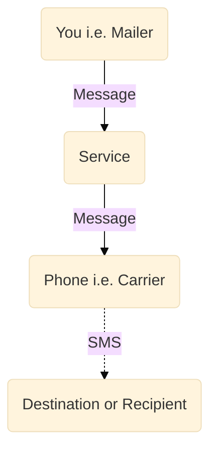

# Doot SMS server overview

## Problem

There are already available SMS APIs but they have following drawbacks.

1. You can't send SMS using your phone this makes difficult to follow up on conversations initiated by the API.
2. You have to pay for sending sms, which is wasteful if you already have an SMS pack on your phone.

## Solution

The solution is a service which you link your phone to. Then you command the service to send a message which will inform your phone to send the said message.

You can use the GraphQL API to send commands to the service.

Flowchart of how messages are sent(simplified).

## Workflow

### Setup

- Create a Mailer account
- Create a Carrier account from your Android phone.
- From your phone(make sure you're logged in) search your mailer username and send request to it.
- From your mailer account, login and accept the request sent by your phone.

### Usage

## Techstack

I started this project as a small personal project so my decision are hugely effected by my opinions.

- **NodeJS**  
  Non-blocking I/O, simple to use, interpreted hence easier to develop on weak hardware. I wrote an API server in Rust once which took a long time to compile on my weak PC, hence interpreted is a plus for rapid development in my case.
- **TypeScript**  
  Type checking, auto-complete suggestions. Coming from C++ I love these features.
- **PostgreSQL**  
  Relational Databases are adequate for most usecases and this project was no different. A Mailer can be related to several Carriers (vice-versa), and many Message. Also a Message is related to the Mailer who created it and a Carrier(Phone) which sent it.
  Reason for choosing PostgreSQL instead of other RDBMSs, personal preference.
- **TypeORM**  
  Type Object Relational Mapper, enables me use TypeScript classes to access postgress, create/update tables and entries with type checking.
- **GraphQL**  
  During intial development the API was a ReST API but the number of endpoints was too much for me to remember, also writing frontend would have been hell, though I was using OpenAPIv3 for documentation the process was still manual and I had to used postman.

  GraphQL solved following problems.

  1. Single endpoint (one for Mailers, one for Carriers).
  2. Auto documentation of API (good enough).

- **TypeGraphQL**  
  TypeGraphQL enabled type checking and reusing the TypeORM model for generating GraphQL schema. Also it's easy to do validation of data.
