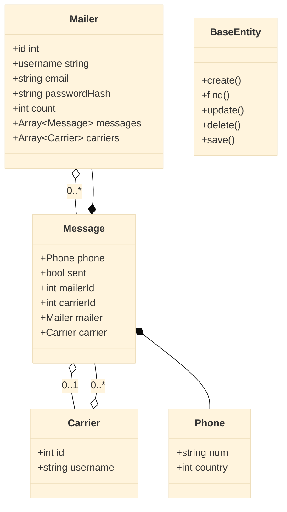

# Technical Documentation

This document compromises of various diagrams that help you grasp how this application works.

```mermaid
%%{init: {'securityLevel': 'loose', 'theme':'base'}}%%
classDiagram
	Mailer o-- Message : 0..*
	Message *-- Mailer
	Carrier o-- Message : 0..*
	Message o-- Carrier : 0..1
	Message *-- Phone

	class BaseEntity {
		+create()
		+find()
		+update()
		+delete()
		+save()
	}

	class Mailer {
		+id int
		+username string
		+string email
		+string passwordHash
		+int count
		+Array~Message~ messages
		+Array~Carrier~ carriers
	}

	class Message {
		+Phone phone
		+bool sent
		+int mailerId
		+int carrierId
		+Mailer mailer
		+Carrier carrier
	}

	class Carrier{
		+int id
		+string username
	}

	class Phone {
		+string num
		+int country
	}
```
